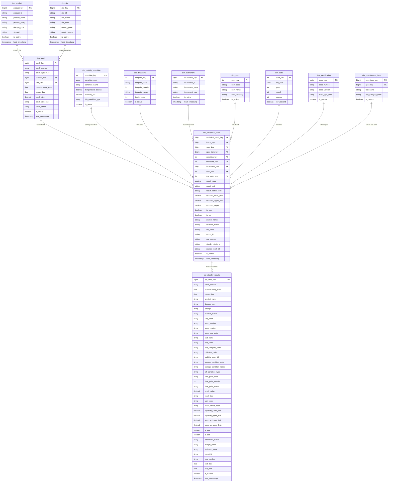

# Entity Relationship Diagrams — Pharma Quality Data Model

**Catalog:** `pharma_quality`
**Platform:** Databricks (Delta Lake, Unity Catalog)
**Architecture:** Medallion (L1 → L2.1 → L2.2 → L3)

This page contains Mermaid ER diagrams for the two primary domains in the pharma quality data model. For full column dictionaries, business rules, and deployment guidance see the links below.

## Related Documentation

| Document | Description |
|----------|-------------|
| [Unified Data Model Specification](./unified_data_model_specification.md) | Full spec — all layers, business rules, CTD mapping, lineage |
| [README](../README.md) | Repository overview, deployment instructions |

---

## 1. Specification Data Model

**Schema:** `l2_2_unified_model` (star schema + denormalized)
**L3 Output:** `l3_data_product.obt_specification_ctd`, `l3_data_product.obt_acceptance_criteria`

The specification model captures drug substance and drug product specifications from LIMS, PDF/SOP documents, and process recipe systems. It supports regulatory filing (CTD Module 3) and quality control workflows.

```mermaid
erDiagram

    dim_date {
        int date_key PK
        date full_date
        int year
        int quarter
        int month
        string month_name
        int day_of_month
        int day_of_week
        string day_name
        int week_of_year
        boolean is_weekend
        int fiscal_year
        int fiscal_quarter
    }

    dim_uom {
        int uom_key PK
        string uom_code
        string uom_name
        string uom_category
        decimal si_conversion_factor
        string si_base_unit
        boolean is_active
    }

    dim_limit_type {
        int limit_type_key PK
        string limit_type_code
        string limit_type_name
        string limit_type_description
        int hierarchy_rank
        boolean is_regulatory
        boolean is_active
    }

    dim_regulatory_context {
        int regulatory_context_key PK
        string region_code
        string region_name
        string submission_type
        string ctd_module
        string ctd_section_title
        string regulatory_authority
        boolean is_active
    }

    dim_product {
        bigint product_key PK
        string product_id
        string product_name
        string product_family
        string brand_name
        string dosage_form
        string route_of_administration
        string therapeutic_area
        string strength
        boolean is_active
        date effective_from
        date effective_to
        timestamp load_timestamp
    }

    dim_material {
        bigint material_key PK
        string material_id
        string material_name
        string material_type
        string cas_number
        string inn_name
        string compendial_name
        string grade
        boolean is_active
        date effective_from
        date effective_to
        timestamp load_timestamp
    }

    dim_site {
        bigint site_key PK
        string site_id
        string site_name
        string site_type
        string country_code
        string country_name
        string region_code
        boolean is_active
        date effective_from
        date effective_to
        timestamp load_timestamp
    }

    dim_market {
        bigint market_key PK
        string market_code
        string market_name
        string region_code
        string region_name
        string regulatory_authority
        boolean is_active
        timestamp load_timestamp
    }

    dim_test_method {
        bigint test_method_key PK
        string test_method_id
        string method_name
        string method_number
        string method_version
        string method_type
        string technique
        string compendia_reference
        boolean is_validated
        boolean is_active
        date effective_from
        date effective_to
        timestamp load_timestamp
    }

    dim_specification {
        bigint spec_key PK
        string source_specification_id
        string spec_number
        string spec_version
        string spec_title
        string spec_type_code
        string spec_type_name
        bigint product_key FK
        bigint material_key FK
        bigint site_key FK
        bigint market_key FK
        string status_code
        string status_name
        string stage_code
        string dosage_form
        string strength
        string compendia_reference
        string ctd_section
        int effective_start_date_key FK
        int effective_end_date_key FK
        int approval_date_key FK
        string approved_by
        bigint supersedes_spec_key FK
        boolean is_current
        timestamp valid_from
        timestamp valid_to
        timestamp load_timestamp
    }

    dim_specification_item {
        bigint spec_item_key PK
        string source_spec_item_id
        bigint spec_key FK
        bigint test_method_key FK
        int uom_key FK
        string test_code
        string test_name
        string analyte_code
        string parameter_name
        string test_category_code
        string test_category_name
        string test_subcategory
        string criticality_code
        int sequence_number
        string reporting_type
        int result_precision
        boolean is_required
        string compendia_test_ref
        string stage_applicability
        boolean is_current
        timestamp valid_from
        timestamp valid_to
        timestamp load_timestamp
    }

    fact_specification_limit {
        bigint spec_limit_key PK
        bigint spec_key FK
        bigint spec_item_key FK
        int limit_type_key FK
        int uom_key FK
        int effective_start_date_key FK
        int effective_end_date_key FK
        int last_calculated_date_key FK
        decimal lower_limit_value
        decimal upper_limit_value
        decimal target_value
        decimal limit_range_width
        string lower_limit_operator
        string upper_limit_operator
        string limit_text
        string limit_description
        string limit_basis
        string stage_code
        string stability_time_point
        string stability_condition
        string calculation_method
        int sample_size
        boolean is_in_filing
        string regulatory_basis
        string source_limit_id
        boolean is_current
        timestamp load_timestamp
    }

    dspec_specification {
        bigint dspec_key PK
        bigint spec_key FK
        bigint spec_item_key FK
        string spec_number
        string spec_version
        string spec_type_code
        string spec_type_name
        string product_name
        string material_name
        string site_name
        string market_name
        string status_code
        string stage_code
        string test_name
        string test_code
        string test_category_code
        string criticality_code
        string uom_code
        string reporting_type
        decimal ac_lower_limit
        decimal ac_upper_limit
        decimal ac_target_value
        decimal ac_limit_description
        decimal nor_lower_limit
        decimal nor_upper_limit
        decimal nor_target_value
        decimal par_lower_limit
        decimal par_upper_limit
        decimal par_target_value
        decimal alert_lower_limit
        decimal alert_upper_limit
        decimal action_lower_limit
        decimal action_upper_limit
        boolean is_hierarchy_valid
        boolean is_current
        timestamp load_timestamp
    }

    dim_product ||--o{ dim_specification : "product FK"
    dim_material ||--o{ dim_specification : "material FK"
    dim_site ||--o{ dim_specification : "site FK"
    dim_market ||--o{ dim_specification : "market FK"
    dim_date ||--o{ dim_specification : "effective / approval dates"
    dim_specification ||--o{ dim_specification_item : "contains items"
    dim_specification ||--o{ dspec_specification : "denormalized"
    dim_specification_item ||--o{ dspec_specification : "denormalized"
    dim_test_method ||--o{ dim_specification_item : "method FK"
    dim_uom ||--o{ dim_specification_item : "result unit FK"
    dim_specification_item ||--o{ fact_specification_limit : "has limits"
    dim_specification ||--o{ fact_specification_limit : "degenerate dim"
    dim_limit_type ||--o{ fact_specification_limit : "limit type FK"
    dim_uom ||--o{ fact_specification_limit : "limit unit FK"
    dim_date ||--o{ fact_specification_limit : "effective / SPC dates"
```



### Specification Model — Layer Summary

| Layer | Schema | Tables |
|-------|--------|--------|
| L1 Raw | `l1_raw` | `raw_lims_specification`, `raw_lims_spec_item`, `raw_lims_spec_limit`, `raw_process_recipe`, `raw_pdf_specification` |
| L2.1 Source Conform | `l2_1_scl` | `src_lims_specification`, `src_lims_spec_item`, `src_lims_spec_limit`, `src_process_recipe`, `src_pdf_specification` |
| L2.2 Reference Dims | `l2_2_unified_model` | `dim_date`, `dim_uom`, `dim_limit_type`, `dim_regulatory_context` |
| L2.2 MDM Dims | `l2_2_unified_model` | `dim_product`, `dim_material`, `dim_test_method`, `dim_site`, `dim_market` |
| L2.2 Conformed Dims | `l2_2_unified_model` | `dim_specification`, `dim_specification_item` |
| L2.2 Fact | `l2_2_unified_model` | `fact_specification_limit` |
| L2.2 Denormalized | `l2_2_unified_model` | `dspec_specification` |
| L3 Data Products | `l3_data_product` | `obt_specification_ctd`, `obt_acceptance_criteria` |

### Limit Type Hierarchy

```
PAR  ≥  AC  ≥  NOR,  with  NOR  ≥  ALERT  ≥  ACTION
└── Proven Acceptable Range (design space; in CTD)
        └── Acceptance Criteria (regulatory limit; in CTD)
                └── Normal Operating Range (internal tighter operating range)
                        └── Alert Limit (early warning)
                                └── Action Limit (mandatory investigation)
```

---

## 2. Stability Data Model

**Schema:** `l2_2_unified_model` (analytical dimensions + fact)
**L3 Output:** `l3_data_product.obt_stability_results`

The stability model captures analytical test results from vendor/Excel stability studies. Each result is linked to a batch, test/specification item, ICH storage condition, and time point. It supports OOS/OOT detection, stability trending, and regulatory stability data packages.



### ICH Stability Storage Conditions

| Code | Condition | ICH Type |
|------|-----------|----------|
| `25C60RH` | 25°C / 60% RH | Long-term |
| `30C65RH` | 30°C / 65% RH | Intermediate |
| `40C75RH` | 40°C / 75% RH | Accelerated |
| `5C` | 5°C ± 3°C | Refrigerated |
| `REFRIG` | 2–8°C | Refrigerated |
| `FREEZER` | -20°C ± 5°C | Frozen |

### Standard Stability Time Points

| Code | Months | Description |
|------|--------|-------------|
| `T0` | 0 | Initial (T=0) |
| `T1M` | 1 | 1 Month |
| `T3M` | 3 | 3 Months |
| `T6M` | 6 | 6 Months |
| `T9M` | 9 | 9 Months |
| `T12M` | 12 | 12 Months |
| `T18M` | 18 | 18 Months |
| `T24M` | 24 | 24 Months |
| `T36M` | 36 | 36 Months |

### Stability Model — Layer Summary

| Layer | Schema | Tables |
|-------|--------|--------|
| L1 Raw | `l1_raw` | `raw_vendor_analytical_results` |
| L2.1 Source Conform | `l2_1_scl` | `src_vendor_analytical_results` |
| L2.2 Dims | `l2_2_unified_model` | `dim_batch`, `dim_stability_condition`, `dim_timepoint`, `dim_instrument` |
| L2.2 Shared Dims | `l2_2_unified_model` | `dim_product`, `dim_site`, `dim_uom`, `dim_date`, `dim_specification`, `dim_specification_item` |
| L2.2 Fact | `l2_2_unified_model` | `fact_analytical_result` |
| L3 Data Product | `l3_data_product` | `obt_stability_results` |

---

## 3. Cross-Domain Table Map

All 33 tables across 4 schemas:

```
pharma_quality (catalog)
│
├── l1_raw
│   ├── raw_lims_specification          # LIMS spec headers
│   ├── raw_lims_spec_item              # LIMS spec tests
│   ├── raw_lims_spec_limit             # LIMS spec limits
│   ├── raw_process_recipe              # Recipe system NOR/PAR limits
│   ├── raw_pdf_specification           # Transcribed PDF/SOP specs
│   └── raw_vendor_analytical_results   # Vendor Excel stability results
│
├── l2_1_scl
│   ├── src_lims_specification          # Cleansed, typed LIMS specs
│   ├── src_lims_spec_item              # Cleansed LIMS spec items
│   ├── src_lims_spec_limit             # Cleansed LIMS limits
│   ├── src_process_recipe              # Cleansed recipe limits
│   ├── src_pdf_specification           # Cleansed PDF spec data
│   └── src_vendor_analytical_results   # Cleansed stability results
│
├── l2_2_unified_model
│   ├── [Reference Dims]
│   │   ├── dim_date
│   │   ├── dim_uom
│   │   ├── dim_limit_type
│   │   ├── dim_regulatory_context
│   │   ├── dim_stability_condition     # ICH conditions
│   │   └── dim_timepoint               # Stability time points
│   ├── [MDM Dims]
│   │   ├── dim_product
│   │   ├── dim_material
│   │   ├── dim_test_method
│   │   ├── dim_site
│   │   └── dim_market
│   ├── [Conformed Dims]
│   │   ├── dim_specification           # SCD2 spec headers
│   │   └── dim_specification_item      # SCD2 test items
│   ├── [Analytical Dims]
│   │   ├── dim_batch
│   │   └── dim_instrument
│   ├── [Facts]
│   │   ├── fact_specification_limit    # All limit types, normalized
│   │   └── fact_analytical_result      # Stability test results
│   └── [Denormalized]
│       └── dspec_specification         # Wide pivoted spec table
│
└── l3_data_product
    ├── obt_specification_ctd           # CTD Module 3 filing output
    ├── obt_acceptance_criteria         # AC analysis with hierarchy metrics
    └── obt_stability_results           # Stability trending & OOS/OOT
```
